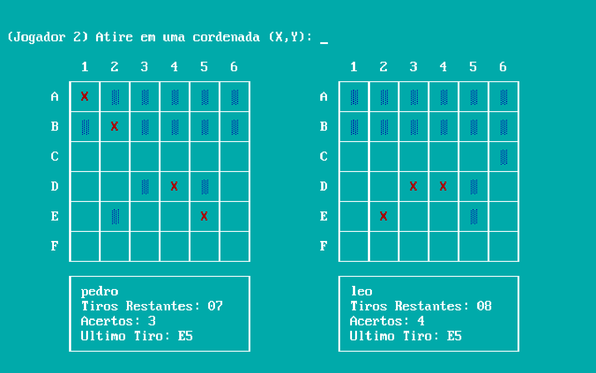

# Batalha Naval - Assembly X86

### 📝 O Projeto

O projeto tem como objetivo colocar em prática o conhecimento adquirido sobre Assembly. No jogo em questão, foi usado o Assembly x86 como base.
O jogo possibilita que dois jogadores joguem, na mesma máquina, o jogo Batalha Naval, posicionando e atirando em navios em conrdenadas representadas em uma matriz.
De forma visual, é possivel jogar o jogo emulado em x86. 

## 💻 Jogabilidade

- Os jogadores digitam o nome pelo qual querem ser chamados no jogo.
- Para iniciar o jogo, o jogador N1 posiciona os 5 navios em seu território, a partir das cordenadas "LetraNumero", da forma que desejar. Da mesma forma, o jogador N2 executa a mesma ação.
- De forma alternada, os jogadores atiram no terreno inimigo, até que afunde todos os navios inimigos ou utilizem todos os disparos disponíveis.
- O jogador vencedor tem seu nome enunciado na tela de finalização do jogo.

## 🤝 Contato

Para contato, me disponibilizo para eventuais dúvidas pelo e-mail:
leonardo.mfern@gmail.com
